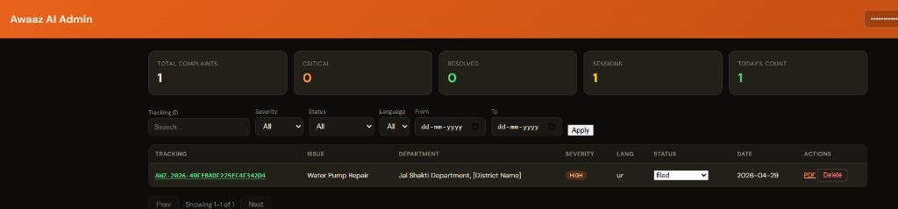
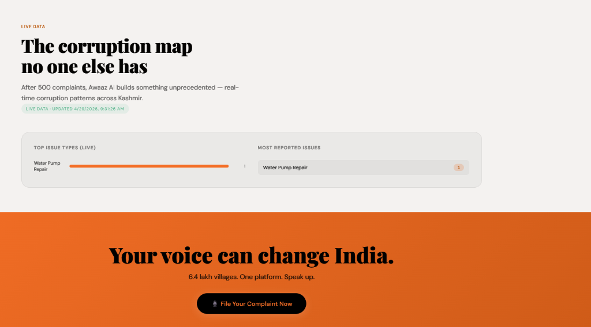
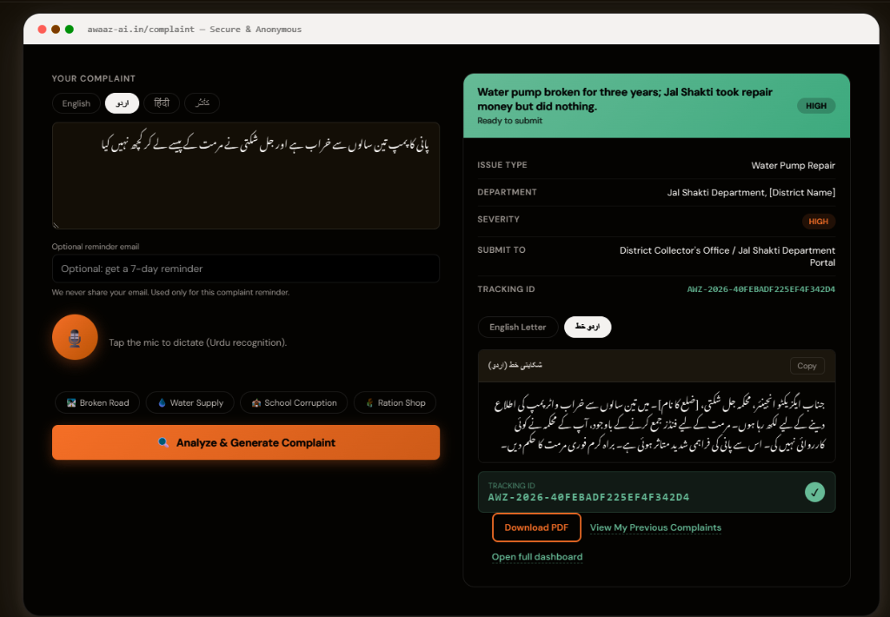
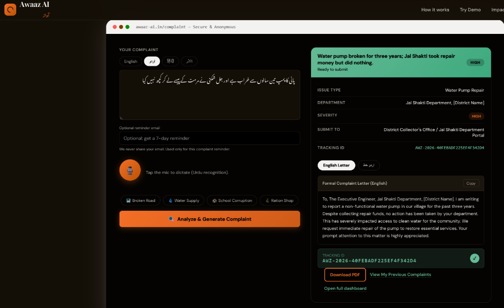
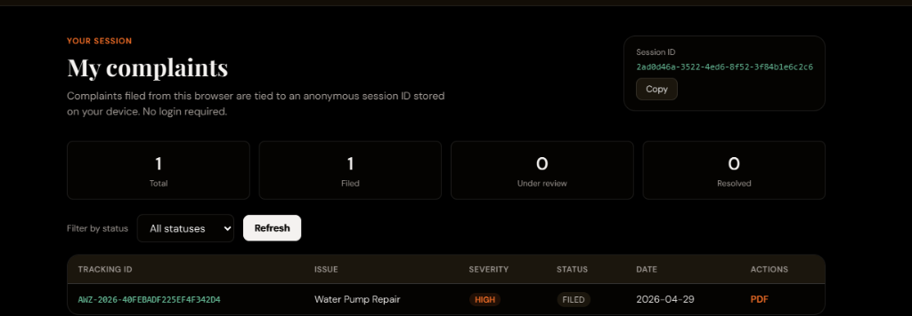

# Awaaz AI — آواز

Voice-first civic complaint platform with multilingual drafting, tracking, user dashboard, and admin operations.

**Tagline:** ہر شہری کی آواز، اب ایک شکایت بن سکتی ہے · हर नागरिक की आवाज़ अब शिकायत बन सकती है

## Project status

This repository is feature-complete for the current scope and includes:

- Citizen complaint submission (text + voice flows)
- AI-assisted complaint structuring and draft generation
- Session-based user dashboard (`/dashboard`)
- Admin dashboard (`/admin`) with lifecycle controls
- PDF export, stats, persistence, tests, and deployment assets

Features that depend on external APIs degrade gracefully when keys are missing (for example, analyze/transcribe/email workflows).

## What is implemented today

- **Languages:** English (`en`), Urdu (`ur`), Hindi (`hi`), Kashmiri (`ks`)
- **Input modes:** text input, browser speech recognition, optional uploaded-audio transcription
- **AI flow:** issue type, department, severity, submit-to guidance, English/Urdu draft letters, summary
- **Tracking:** unique complaint IDs + session IDs
- **User dashboard:** complaint history for the current browser session, status filters, metrics, PDF links
- **Admin panel:** token-protected listing, filtering, status update (`filed|under_review|resolved|rejected`), deletion
- **Data layer:** SQLite (`better-sqlite3`) with schema/init and indexed queries
- **Stats:** aggregate endpoints and homepage visualization
- **Follow-up email:** optional encrypted email storage + cron-based reminder job
- **Quality:** Vitest (API/unit), Playwright E2E, deploy smoke script + CI workflows
- **Deployment:** Docker + Render Blueprint with persistent disk setup

## Platform Overview

### 1. Admin Control Center
A secure portal for administrators to review, filter, and manage all filed complaints, including one-click PDF generation and lifecycle tracking.



### 2. Live Impact Analytics
A public-facing dashboard demonstrating real-time patterns, top issue types, and transparent metrics across regions.



### 3. AI-Powered Complaint Submission
A multilingual, voice-first interface allowing citizens to dictate issues in their native language while AI structures formal complaint letters.





### 4. Anonymous Citizen Dashboard
Session-based tracking allowing users to monitor the status of their submitted complaints without requiring account creation.



## Current non-goals and limitations

These are intentional scope boundaries (not broken features):

- No full RBAC/multi-role auth (single admin secret model)
- No OTP/user accounts for citizen login
- Session dashboard is session-ID based (not account-based ownership)
- Public tracking ID still allows complaint detail/PDF access by ID design, but IDs are high-entropy and not sequential

## Tech stack

- **Runtime:** Node.js (ESM)
- **Backend:** Express, Helmet, CORS, express-rate-limit, Zod
- **Database:** SQLite via `better-sqlite3`
- **AI:** Gemini (`gemini-2.5-flash-lite`) with optional Groq fallback
- **Transcription fallback:** Groq Whisper endpoint
- **PDF:** PDFKit
- **Email:** Resend (optional)
- **Scheduler:** node-cron
- **Logging:** Pino
- **Testing:** Vitest + Supertest + Playwright

## Quick start (local)

1. Clone repository.
2. Create env file:
   - Bash: `cp .env.example .env`
   - PowerShell: `Copy-Item .env.example .env`
3. Install dependencies:
   - `npm install`
4. Run app:
   - `npm run dev` (watch mode) or `npm start`
5. Open `http://localhost:8080`.

### Required vs optional keys

- **Required for AI analyze:** `GEMINI_API_KEY`
- **Required for secured admin access:** `ADMIN_TOKEN` (recommended in all environments)
- **Optional:** `GROQ_API_KEY`, `RESEND_API_KEY`, `EMAIL_SECRET`, `PUBLIC_BASE_URL`, `CORS_ORIGIN`
- **Cost controls (recommended):**
  - `GEMINI_MAX_TOKENS=1100`
  - `GEMINI_LETTER_STYLE=compact`
  - `ENABLE_GROQ_FALLBACK=1` (uses Groq only when Gemini fails)
  - `ANALYZE_CACHE_MAX_ITEMS=300` and `ANALYZE_CACHE_TTL_MS=86400000` (24h cache)
  - `DAILY_AI_TOKEN_BUDGET=0` (set >0 to enforce daily token guardrail)

If you change Node versions and hit native module ABI errors:

```bash
npm rebuild better-sqlite3
```

## Routes and APIs

### Pages

- `GET /` — main citizen interface
- `GET /dashboard` — user session dashboard
- `GET /admin` — admin dashboard (Basic auth when `ADMIN_TOKEN` is set)

### Public APIs

- `GET /api/health`
- `GET /api/stats`
- `POST /api/analyze`
- `POST /api/transcribe` (optional external API dependency)
- `GET /api/session/complaints?sessionId=...`
- `GET /api/complaints/:trackingId`
- `GET /api/complaints/:trackingId/pdf`

### Admin APIs

- `GET /api/complaints`
- `PATCH /api/complaints/:trackingId/status`
- `DELETE /api/complaints/:trackingId`

Admin APIs require `Authorization: Bearer <ADMIN_TOKEN>` when `ADMIN_TOKEN` is configured.

## Admin and privacy behavior

- `/admin` uses Basic auth: username `admin`, password = `ADMIN_TOKEN`
- Admin can access complaint operations and full complaint detail used by the panel
- Raw optional emails are not stored directly; encrypted at rest with `EMAIL_SECRET`
- Session dashboard returns metadata list, not full records

## Testing

### Local test commands

- `npm run test:ci` — Vitest API/unit suite
- `npm run test:e2e` — Playwright smoke suite
- `npm run test:all` — CI + E2E
- `npm run test:coverage` — coverage
- `npm run test:deploy` — post-deploy smoke against live URL

### Deploy smoke usage

PowerShell:

```powershell
$env:SMOKE_URL="https://your-service.onrender.com"
npm run test:deploy
```

Optional smoke env vars:

- `SMOKE_ADMIN_TOKEN` — test admin API path
- `SMOKE_SKIP_ANALYZE=1` — skip real analyze call (default for CI)
- `SMOKE_RUN_ANALYZE=1` — force one live analyze call

## Deploy on Render (recommended)

This repo uses one Blueprint file:

| File | Tier | SQLite |
|------|------|--------|
| [`render.yaml`](render.yaml) | **Free** (`plan: free`) | Ephemeral — data may reset on redeploy/restart ([Render free tier cannot use disks](https://render.com/docs/free)) |

### Deploy steps

1. Push repository to GitHub/GitLab/Bitbucket.
2. Create a **Blueprint Instance** in Render (default path `render.yaml`).
3. Confirm:
   - plan is `free`
   - no persistent disk
   - `DB_PATH=data/awaaz.db`
   - health check path `/api/health`

If you want persistent SQLite later, move to a paid plan and attach a disk in Render (`/data`), then set `DB_PATH=/data/awaaz.db`.

### Render environment variables

Set in Render dashboard:

- `GEMINI_API_KEY`
- `ADMIN_TOKEN`
- `EMAIL_SECRET`
- `PUBLIC_BASE_URL`
- Optional: `GROQ_API_KEY`, `RESEND_API_KEY`, `CORS_ORIGIN`

Already defined in `render.yaml`: `NODE_ENV`, `DB_PATH`, `LOG_LEVEL`.

### First deploy verification

1. `GET /api/health` returns `{ ok: true }`
2. Homepage loads
3. Complaint submission works (with Gemini key)
4. `/dashboard` loads and shows session data
5. `/admin` opens with `admin` + `ADMIN_TOKEN`
6. Admin list/status/PDF flows work

## Security controls

- Helmet + CSP headers
- API and analyze route rate limiting
- Schema validation using Zod
- Structured logs with correlation IDs
- AES-256-GCM encryption for stored reminder emails

## Repo references

- Deployment checklist: [`docs/DEPLOY-CHECKLIST.md`](docs/DEPLOY-CHECKLIST.md)
- Render blueprint: free [`render.yaml`](render.yaml)
- CI workflows: [`.github/workflows/ci.yml`](.github/workflows/ci.yml), [`.github/workflows/deploy-smoke.yml`](.github/workflows/deploy-smoke.yml)
- Env template: [`.env.example`](.env.example)

## License

Currently intended for civic-tech/educational use. Add a formal OSS `LICENSE` file before public distribution.
