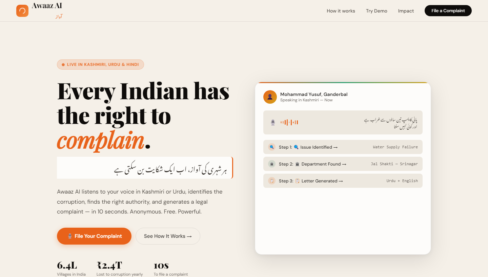
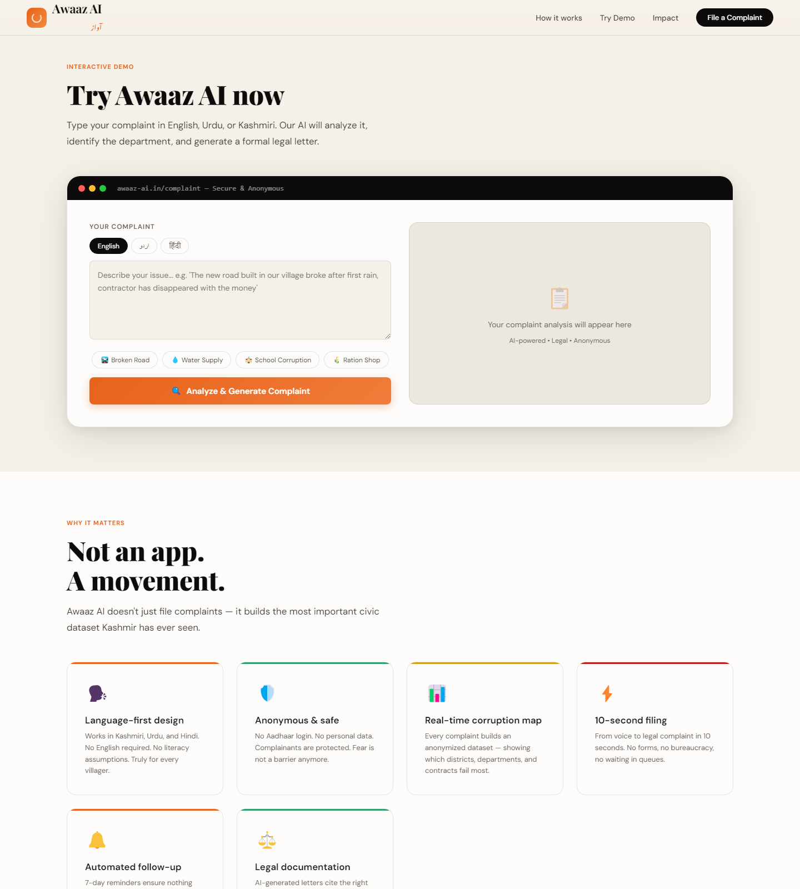
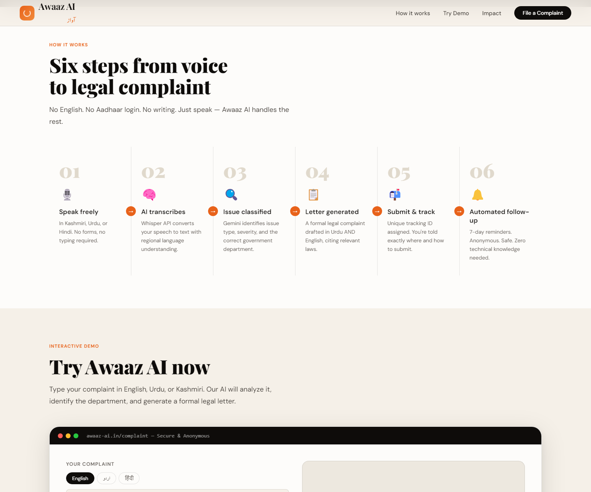
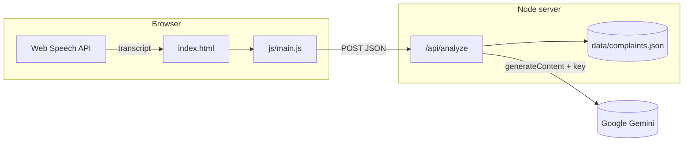

<div align="center">


# Awaaz AI · آواز

**Voice of the Unheard** — a civic-tech concept for **rural India**, turning everyday voices into structured, actionable complaints with AI assistance.

<br />

[](https://developer.mozilla.org/docs/Web/HTML)
[](https://developer.mozilla.org/docs/Web/CSS)
[](https://developer.mozilla.org/docs/Web/JavaScript)
[](https://ai.google.dev/)
[](https://fonts.google.com/)

[](.)
[](.)
[](.)

<br />

[Problem statement](#problem-statement) · [Implemented solution](#implemented-solution) · [Tech stack](#tech-stack) · [UI gallery](#ui-gallery) · [Run locally](#run-locally) · [Structure](#project-structure)

**[Full platform specification — everything built vs missing →](docs/PLATFORM-SPEC.md)**

</div>

---

## Problem statement

Citizens in **rural India**—especially in regions where **Kashmiri, Urdu, and Hindi** are primary languages—face a structural gap between lived problems and **documented, traceable** grievances. Government systems and portals are often **English-first**, form-heavy, and department-specific. That creates friction for people who lack time, digital literacy, or familiarity with official vocabulary.

| Challenge | Impact |
|-----------|--------|
| **Language & literacy** | Many issues are expressed in regional languages, while **official channels** remain hard to navigate or translate into. |
| **Process opacity** | Filing a “proper” complaint can require knowing **which department**, **which format**, and **which channel**—a barrier without networks or legal language. |
| **Invisible harm** | Problems that **never become structured records** are **lost to accountability** and planning—so patterns of **neglect** are harder to challenge with evidence. |

**Awaaz AI** addresses this **documentation gap**: it does **not** replace courts or government portals; it **lowers the cost** of turning a plain-language account into a **structured, trackable** civic record that can be **submitted, followed up, and cited**.

---

## Implemented solution

This repository ships a **full-stack demo** that matches that intent:

| Layer | What it does |
|--------|----------------|
| **Experience** | A **single-page** site with narrative sections (problem → how it works → impact → demo), **responsive** layout, and **multilingual** UI cues (English / اردو / हिंदी). |
| **Interactive demo** | Users **type or use the mic** (Web Speech API in Chrome/Edge); the **Node.js** backend calls **Google Gemini** with a **server-only** API key and returns **structured JSON** (issue type, department, severity, submission hints, draft letters) plus a **tracking ID**. |
| **Persistence** | Analyses are appended to **`data/complaints.json`** (created at runtime) for **demo traceability**—not a production-grade government backend. |
| **Design** | Implemented **sand / ink / saffron / emerald** palette, **Playfair Display**, **DM Sans**, **Noto Nastaliq Urdu**, hero animation, and **sticky** navigation with mobile menu. |

> **Honest scope:** This is a **concept demo** with a **JSON file store** and **rate-limited** API. Hardening (auth, retention, real submission channels) is **out of scope** unless you extend it.

For a **complete, section-by-section inventory** of the UI, client modules, server endpoints, environment variables, persistence model, and a **detailed list of missing backend/product features** (database, auth, server-side STT, integrations, ops) plus a **phased roadmap**, see **[docs/PLATFORM-SPEC.md](docs/PLATFORM-SPEC.md)**.

---

## Tech stack

| Layer | Choice | Notes |
|--------|--------|--------|
| **Markup** | Semantic HTML5 | Sections, accessibility-minded structure |
| **Styling** | Modular CSS | Design tokens (`css/variables.css`), no Tailwind/Bootstrap |
| **Fonts** | Google Fonts | Playfair Display, DM Sans, Noto Nastaliq Urdu |
| **Script** | ES modules | `import` / `export`; entry `js/main.js` |
| **Voice input** | Web Speech API | `js/voice.js` — speech-to-text into the complaint field (Chromium; HTTPS or localhost) |
| **AI** | Google Gemini (`generateContent`) | Server-side only — `server/lib/gemini.js`, env `GEMINI_API_KEY` |
| **Backend** | Node.js + Express | `server/index.js` — REST API, static files, rate limit |
| **Persistence** | JSON file store | `data/complaints.json` (created on first analyze) |
| **Tooling** | `npm run dev` / `npm start` | Single process for UI + API |

<p align="center">
  
  
  
</p>

---

## UI gallery

Screenshots below are **captured from the running app** (local server, Chromium)—the same layout and styles as in `index.html` and `css/`.

| Landing & hero | Interactive demo (complaint input + results) |
|:---:|:---:|
|  |  |

| How it works (six steps) |
|:---:|
|  |

**Implemented in code:** sticky **navigation**; **hero** with animated demo card; **problem strip**; **How it works** grid; **Live demo** with **English / اردو / हिंदी** samples, **microphone dictation**, and analyze flow; **Impact**, **corruption map** (illustrative), **CTA**, **footer**.

---

## Architecture (high level)



> **Security:** The **Gemini API key** lives only on the server (`GEMINI_API_KEY` in `.env`). The browser calls **`/api/analyze`** on the same origin.

---

## Run locally (full stack — recommended)

1. **Install dependencies**

```bash
cd AWAAZ-AI
npm install
```

2. **Configure Gemini** — copy `.env.example` to `.env` and set your key:

```bash
copy .env.example .env
# Edit .env: set GEMINI_API_KEY=...
```

3. **Start the backend** (serves the static UI + API on one port):

```bash
npm run dev
```

Open **http://localhost:8080** (default `PORT`; override in `.env`).

| Script | Purpose |
|--------|---------|
| `npm run dev` | Server with **watch** reload (`node --watch`) |
| `npm start` | Production-style run (no watch) |
| `npm run serve-static` | **Static files only** on port 3000 — `POST /api/analyze` will **not** work unless you point `window.__AWAAZ_API_BASE__` at a running API |

---

## Project structure

```
AWAAZ-AI/
├── README.md
├── docs/
│   └── PLATFORM-SPEC.md        # Full inventory: built vs missing + roadmap
├── package.json
├── .env.example
├── index.html
├── assets/
│   ├── readme-banner.png
│   ├── ui-landing.png
│   ├── ui-interactive-demo.png
│   └── ui-how-it-works.png
├── server/
│   ├── index.js                 # Express: API + static SPA
│   └── lib/
│       ├── gemini.js             # Server-side Gemini generateContent
│       └── store.js             # JSON persistence (data/complaints.json)
├── data/                        # Created at runtime (gitignored)
│   └── complaints.json
├── css/
│   └── …
└── js/
    ├── config.js                # API base URL (empty = same origin)
    ├── samples.js
    ├── ui.js
    ├── voice.js                 # Web Speech API → textarea
    ├── analyze.js               # POST /api/analyze
    └── main.js
```

---

## Backend API

| Method | Path | Description |
|--------|------|-------------|
| `GET` | `/api/health` | Liveness + `geminiConfigured` flag |
| `POST` | `/api/analyze` | Body: `{ "text": string, "language"?: string }` → `{ trackingId, analysis }` |
| `GET` | `/api/complaints?limit=&offset=` | Summary list (optional **`ADMIN_TOKEN`** via `Authorization: Bearer …`) |
| `GET` | `/api/complaints/:trackingId` | Full stored analysis for a tracking ID |

Complaints are stored under **`data/complaints.json`** (cap configurable via `COMPLAINTS_MAX_STORED`). **Do not commit real citizen data** — treat as a demo store; harden retention and access for production.

**Environment:** See **`.env.example`** (`GEMINI_API_KEY`, `PORT`, `GEMINI_MODEL`, `ADMIN_TOKEN`, rate limits).

**Split frontend:** serve the static folder elsewhere and set `window.__AWAAZ_API_BASE__ = 'https://your-api-host'` before loading `main.js`.

---

## Roadmap (ideas)

High-level items; **gaps and phases A–E** are expanded in **[docs/PLATFORM-SPEC.md](docs/PLATFORM-SPEC.md)** (§3–§4).

- [x] Voice capture + browser speech-to-text (Web Speech API)  
- [x] Backend proxy + persistence (basic JSON store)  
- [ ] **Phase A (harden):** real DB, retention, Helmet, tests, structured logs  
- [ ] **Phase B (trust):** sessions/auth, admin UI, safer complaint retrieval  
- [ ] **Phase C (voice server):** audio upload + server-side transcription  
- [ ] **Phase D (outbound):** email/PDF, CPGRAMS/deep links, webhooks  
- [ ] **Phase E (ops):** Docker, CI, monitoring  
- [ ] Replace illustrative map data with live aggregates  

---

## Credits

Built with a focus on **clarity**, **accessibility of language**, and **honest scope** — civic tech starts with trustworthy UX and transparent limitations.

<div align="center">

**Awaaz AI** · *آواز — Voice of the Unheard*

Made for India.

</div>
