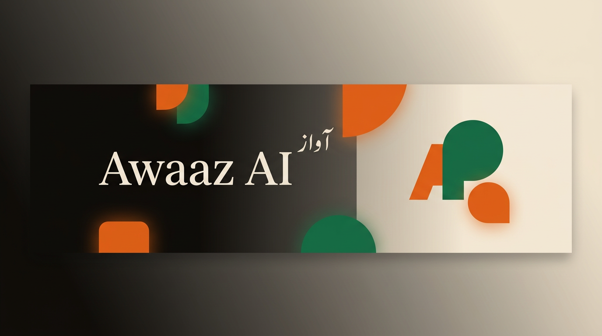
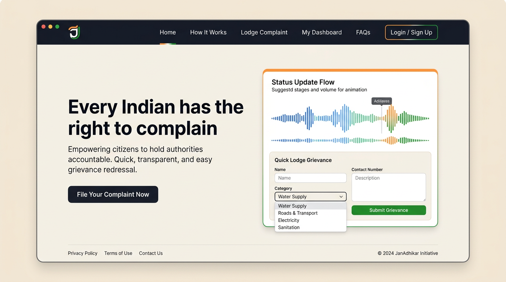
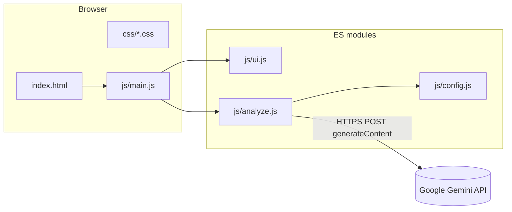

<div align="center">



# Awaaz AI · آواز

**Voice of the Unheard** — a civic-tech concept for **rural India**, turning everyday voices into structured, actionable complaints with AI assistance.

<br />

[](https://developer.mozilla.org/docs/Web/HTML)
[](https://developer.mozilla.org/docs/Web/CSS)
[](https://developer.mozilla.org/docs/Web/JavaScript)
[](https://ai.google.dev/)
[](https://fonts.google.com/)

[](.)
[](.)
[](.)

<br />

[Problem statement](#-problem-statement) · [Solution](#-what-awaaz-ai-does) · [Tech stack](#-tech-stack) · [UI overview](#-interface-overview) · [Run locally](#-run-locally) · [Structure](#-project-structure)

</div>

---

## Problem statement

India has **hundreds of thousands of villages** and deep-rooted gaps between citizens and the offices meant to serve them. In practice:

| Challenge | Why it matters |
|-----------|----------------|
| **Language & literacy** | Many grievances are voiced in **Kashmiri, Urdu, or Hindi**, while official portals and forms are often **English-first** or hard to navigate. |
| **Access & trust** | Filing a “proper” complaint can require knowing **which department**, **which format**, and **which portal** — a barrier for people without time, networks, or legal vocabulary. |
| **Lost signal** | Issues that never become **documented, traceable complaints** are invisible to accountability and planning — so **corruption and neglect stay cyclic**. |

**Awaaz AI** is framed as a response to that gap: **lower the cost of turning a real story into a formal, trackable civic record** — starting with language-friendly input and AI-assisted structuring, not replacing courts or official processes.

---

## What Awaaz AI does

In this repository, **Awaaz AI** is implemented as a **single-page web experience** that:

- Presents a **clear narrative** (problem → how it works → impact → demo).
- Offers an **interactive demo**: users describe a complaint (with **English / اردو / हिंदी** samples), and **Google Gemini** returns structured JSON used to fill **issue type, department, severity, submission hint, bilingual letters, and a tracking-style ID**.
- Emphasizes **design** aligned with the product story: warm **sand / ink / saffron / emerald** palette, **Playfair Display**, **DM Sans**, **Noto Nastaliq Urdu**, responsive layout, and motion on the hero demo card.

> **Scope:** This repo is a **front-end + client-side API call** demo. It does **not** include a production backend, database, or real submission to government systems unless you add them.

---

## Tech stack

| Layer | Choice | Notes |
|--------|--------|--------|
| **Markup** | Semantic HTML5 | Sections, accessibility-minded structure |
| **Styling** | Modular CSS | Design tokens (`css/variables.css`), no Tailwind/Bootstrap |
| **Fonts** | Google Fonts | Playfair Display, DM Sans, Noto Nastaliq Urdu |
| **Script** | ES modules | `import` / `export`; entry `js/main.js` |
| **AI** | Gemini `generateContent` | Config in `js/config.js` (`gemini-2.0-flash`) |
| **Tooling** | `serve` (via npm) | Local static server for ES modules |

<p align="center">
  
  
  
</p>

---

## Interface overview

<p align="center">
  
</p>

<p align="center"><em>PNG preview assets in <code>assets/</code> — swap filenames if you add new screenshots.</em></p>

**UI highlights (implemented in code):**

- Sticky **navigation** with mobile menu  
- **Hero** with animated demo card (wave bars, staged steps, tracking badge)  
- **Problem strip**, **How it works** (6 steps), **Live demo**, **Impact**, **Corruption map** (illustrative), **CTA**, **Footer**

---

## Architecture (high level)



> **Security:** Avoid exposing API keys in the client. Use a **proxy** or **backend** that attaches credentials, or restrict keys by domain/referrer per Google’s policies.

---

## Run locally

ES modules require a **local HTTP server** (not `file://`).

```bash
cd AWAAZ-AI
npm install   # optional; scripts use npx
npm run dev
```

Open **http://localhost:3000** (or the URL printed by `serve`).

**Alternative:**

```bash
npx --yes serve -l 3000 .
```

---

## Project structure

```
AWAAZ-AI/
├── README.md
├── package.json
├── index.html
├── assets/
│   ├── readme-banner.png      # README header (PNG)
│   └── ui-preview-mockup.png  # UI preview for docs (PNG)
├── css/
│   ├── main.css                 # @imports
│   ├── variables.css
│   ├── animations.css
│   ├── base.css
│   ├── nav.css
│   ├── hero.css
│   ├── sections.css
│   ├── demo.css
│   ├── impact.css
│   ├── map.css
│   ├── cta-footer.css
│   └── ui-components.css
└── js/
    ├── config.js                # Gemini endpoint + model
    ├── samples.js               # Demo complaint samples
    ├── ui.js                    # Language, tabs, copy
    ├── analyze.js               # fetch + parse + UI update
    └── main.js                  # Bootstrap + event wiring
```

---

## Configure Gemini

Edit **`js/config.js`**:

- **`url`** — full `:generateContent` URL (or your **proxy** URL).
- **`model`** — must match the model segment in the path if you change it.

For production, prefer **server-side** or **proxy** calls so keys are not shipped in static assets.

---

## Roadmap (ideas)

- [ ] Voice capture + speech-to-text pipeline  
- [ ] Backend persistence and user-safe anonymity model  
- [ ] Real submission hooks (email, portal links, PDF export)  
- [ ] Replace illustrative map data with live aggregates  

---

## Credits

Built with a focus on **clarity**, **accessibility of language**, and **honest scope** — civic tech starts with trustworthy UX and transparent limitations.

<div align="center">

**Awaaz AI** · *آواز — Voice of the Unheard*

Made for India.

</div>
